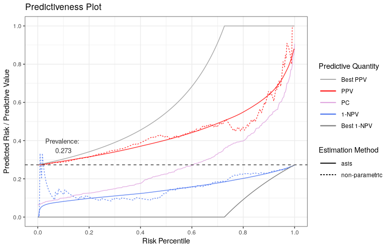
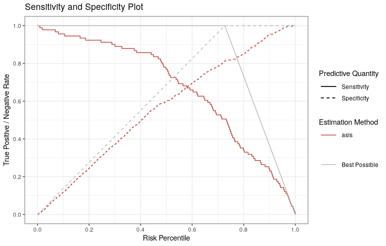

# stats4phc 

<!-- start badges -->
[](https://genentech.github.io/stats4phc/main/unit-test-report/)
[](https://genentech.github.io/stats4phc/)
[](https://genentech.github.io/stats4phc/main/coverage-report/)
<!-- end badges -->

Performance evaluation for the prognostic value of predictive models intended to 
support personalized healthcare (phc) when the outcomes of interest are binary. 
<a href="https://pubmed.ncbi.nlm.nih.gov/17982157/" target="_blank">Predictiveness curves</a>
are an insightful visualization to assess the inherent ability of such 
models to provide predictions to individual patients. Cumulative versions of predictiveness 
curves represent positive predictive values and 1 - negative predictive values and are also 
informative if the eventual goal is to use a cutoff for clinical decision making. 
In addition, predictiveness curves and their cumulative versions are naturally related to 
<a href="https://www.bmj.com/content/352/bmj.i6" target="_blank">net benefit</a>
performance metrics to assess clinical utility for phc. Finally, some authors have 
proposed a visualization that assesses both the prognostic value of predictive models and 
their performance as a classifier. This package provides a variety of functions for estimation 
and plotting of these performance evaluation curves and metrics.


## Installation

``` r
remotes::install_github(repo = "genentech/stats4phc")
```

For reproducibility, refer to a specific version tag, for example

``` r
remotes::install_github(repo = "genentech/stats4phc", ref = "v0.1")
```


## Documentation

Please refer to https://genentech.github.io/stats4phc 
where you can see function reference as well as introduction vignette.

## Example

This is a basic example which demonstrates `riskProfile` function (i.e. Predictiveness Curve):

``` r
library(stats4phc)

# Read in example data
auroc <- read.csv(system.file("extdata", "sample.csv", package = "stats4phc"))
rscore <- auroc$predicted_calibrated
truth <- as.numeric(auroc$actual)

# Default plot includes 1-NPV, PPV, and a predictiveness curve (PC) 
p1 <- riskProfile(outcome = truth, score = rscore)
p1$plot
# You can also access the underlying data with `p1$data`
```



<br/>

and `sensSpec` function (Sensitivity and Specificity Plot):

```r
p2 <- sensSpec(outcome = truth, score = rscore)
p2$plot
```


